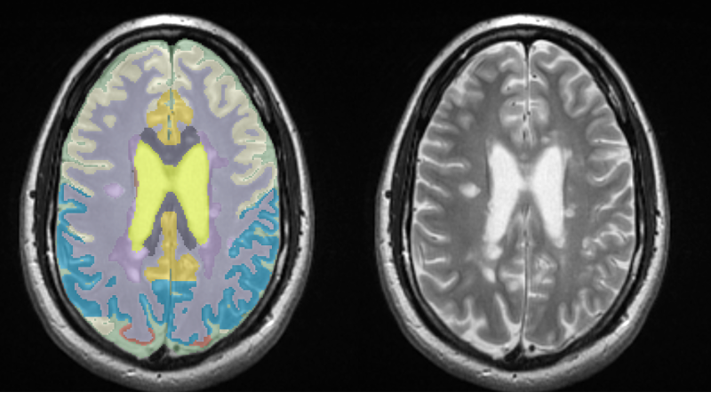

# MindGlide

**Ultrafast segmentation of real‑world brain MRI for multiple‑sclerosis patients — any modality, any quality.** Built with PyTorch + MONAI and trained on >23 000 scans.

<p align="center">
  
</p>

---

## Quick start

```bash
# clone code **and** pretrained checkpoint in one shot
git clone --recurse-submodules https://github.com/MS-PINPOINT/mindGlide.git
cd mindGlide
```

If you already cloned without the flag:

```bash
git submodule update --init --recursive
```

This pulls the model repo from the Hugging Face Hub and places
`models/_20240404_conjurer_trained_dice_7733.pt` in the workspace.

PyTorch trained models are stored on Huggingface:
`https://huggingface.co/MS-PINPOINT/mindglide/tree/main`

Trained models are shared in the `models` directory.
They are trained on the datasets explained in the paper [**Nature Communications (2025)**](https://www.nature.com/articles/s41467-025-58274-8#citeas).


> **Requirements**
> • Git ≥ 2.13
> • Git LFS — one‑time setup: `git lfs install`
> • Docker
> • *(Optional)* Apptainer/Singularity for HPC environments

---

## Run in Docker (GPU)

```bash
docker run --gpus all \  
  --ipc=host --ulimit memlock=-1 -it \  
  -v $PWD:/mnt \  
  mspinpoint/mindglide:may2024 <your_scan>.nii.gz
```

For Singularity/Apptainer, build once then run:

```bash
singularity run --nv \
  --bind $PWD:/mnt \
  /path/to/mind-glide_latest.sif <your_scan>.nii.gz
```

---

## Fine‑tuning

Use the scripts in `scripts/` as a template. Start with a low learning
rate (e.g. 1e‑3) to avoid catastrophic forgetting — shipped models were
trained with 1e‑2.

---

## Model weights

The primary checkpoint lives in this repo at:

```
models/_20240404_conjurer_trained_dice_7733.pt
```

Additional or legacy checkpoints are archived in the [Hugging Face model repo](https://huggingface.co/MS-PINPOINT/mindglide).


### 📬 Citation

If you use MindGlide please cite this paper:

```bibtex
@article{Goebl2025,
    author = {Goebl, Philipp and Wingrove, Jed and Abdelmannan, Omar and {Brito Vega}, Barbara and Stutters, Jonathan and Ramos, {Silvia Da Graca} and Kenway, Owain and Rossor, Thomas and Wassmer, Evangeline and Arnold, Douglas L. and Collins, Louis and Hemingway, Cheryl and Narayanan, Sridar and Chataway, Jeremy and Chard, Declan and Iglesias, {Juan Eugenio} and Barkhof, Frederik and Parker, Geoffrey J. M. and Oxtoby, Neil P. and Hacohen, Yael and Thompson, Alan and Alexander, Daniel C. and Ciccarelli, Olga and Eshaghi, Arman},
    title = {Enabling new insights from old scans by repurposing clinical {MRI} archives for multiple sclerosis research},
    journal = {Nature Communications},
    volume = {16},
    number = {1},
    pages = {3149},
    year = {2025},
    month = apr,
    doi = {10.1038/s41467-025-58274-8},
    pmid = {40195318},
    pmcid = {PMC11976987}
}
```


---

## Acknowledgements

This study/project is funded by the UK National Institute for Health and
Social Care (NIHR) Advanced Fellowship to Arman Eshaghi (Award ID:
NIHR302495). The views expressed are those of the author(s) and not
necessarily those of the NIHR or the Department of Health and Social
Care.

<p align="left">
  
</p>

