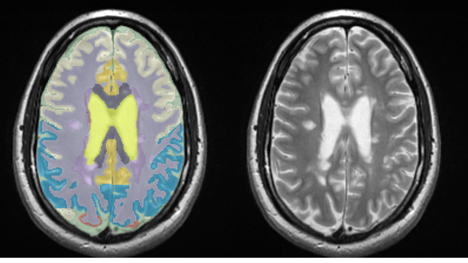

<div align="center">

# MindGlide

**Brain MRI segmentation for multiple sclerosis — any modality, any quality.**

Built with PyTorch + MONAI, trained on >23 000 scans.
[Nature Communications (2025)](https://www.nature.com/articles/s41467-025-58274-8)



</div>

## Get started

```bash
pip install git+https://github.com/MS-PINPOINT/mindGlide.git
mindglide -i scan.nii.gz -o scan_seg.nii.gz
```

That's it. Python ≥ 3.9; runs on GPU (seconds per scan) or CPU (a few minutes) —
picked automatically. The trained model (~123 MB) downloads and caches on first
run. Point `-i` at a folder to segment every NIfTI file in it.

No scan at hand? Try the public MNI152 template:

```bash
curl -O https://templateflow.s3.amazonaws.com/tpl-MNI152NLin2009cAsym/tpl-MNI152NLin2009cAsym_res-01_T1w.nii.gz
mindglide -i tpl-MNI152NLin2009cAsym_res-01_T1w.nii.gz -o mni_seg.nii.gz
```

To get per-region volumes (mm³) as a CSV:

```bash
mindglide-volumes scan_seg.nii.gz --out-csv scan_volumes.csv
```

## Options

| Option | Meaning |
|---|---|
| `--device {auto,cpu,cuda,mps}` | Compute device (default: auto — a working GPU if present, else CPU). |
| `--sw-batch-size N` | Sliding-window batch size (default 4). Lower it if the GPU runs out of memory. |
| `--model-path FILE` | Use a local `.pt` checkpoint instead of the automatic download (offline use). |
| `--resume` | Folder mode: skip scans already segmented in the output folder. |
| `--no-klc` | Keep all connected components (skip largest-component cleanup). |
| `--no-reorient` | Skip internal RAS re-orientation. Output always matches the input scan's grid. |

## Output labels

| Code | Structure                       | Code | Structure                 |
|:----:|:--------------------------------|:----:|:--------------------------|
| 0    | Background                      | 10   | Optic_chiasm              |
| 1    | CSF                             | 11   | Cerebellar_vermis         |
| 2    | Ventricles_3_4_5                | 12   | Corpus_callosum           |
| 3    | DGM                             | 13   | White_matter              |
| 4    | Pons                            | 14   | Frontal_lobe_GM           |
| 5    | Brainstem                       | 15   | Limbic_cortex_GM          |
| 6    | Cerebellum                      | 16   | Parietal_lobe_GM          |
| 7    | Temporal_lobe                   | 17   | Occipital_lobe_GM         |
| 8    | Temporal_horn_lateral_ventricle | 18   | Lesion                    |
| 9    | Lateral_ventricle               | 19   | Ventral_diencephalon      |

<details>
<summary><strong>Troubleshooting</strong></summary>

**"Warning: not using the GPU — … this PyTorch build cannot run on it"** —
the default `pip` PyTorch wheels no longer include kernels for older GPUs
(e.g. Pascal cards: GTX 10xx, Quadro P series). MindGlide falls back to CPU
automatically. To use such a GPU, install a compatible PyTorch first:

```bash
pip install "torch==2.6.0+cu118" --index-url https://download.pytorch.org/whl/cu118
pip install git+https://github.com/MS-PINPOINT/mindGlide.git
```

**GPU out of memory** — try `--sw-batch-size 1`, or `--device cpu`.

**Apple Silicon** — `auto` uses MPS when available. If an operation is
unsupported, run with `--device cpu` or set `PYTORCH_ENABLE_MPS_FALLBACK=1`.

**Offline / air-gapped machines** — download
[the checkpoint](https://huggingface.co/MS-PINPOINT/mindglide/tree/main) once
and pass `--model-path /path/to/model.pt` (or set `MODEL_PATH`).

</details>

<details>
<summary><strong>Docker / Apptainer</strong></summary>

Build once (model weights are baked in, so the container works offline):

```bash
git clone https://github.com/MS-PINPOINT/mindGlide.git
cd mindGlide
docker build -t mindglide .
```

Run (drop `--gpus all` on CPU-only hosts):

```bash
docker run --gpus all --ipc=host -v /data:/data \
  mindglide -i /data/scan.nii.gz -o /data/scan_seg.nii.gz
```

For Apptainer/Singularity on HPC:

```bash
apptainer build mindglide.sif docker-daemon://mindglide:latest
apptainer run --nv -B /data:/data mindglide.sif -i /data/scan.nii.gz -o /data/scan_seg.nii.gz
```

</details>

<details>
<summary><strong>Model weights</strong></summary>

The checkpoint (`_20240404_conjurer_trained_dice_7733.pt`) is downloaded
automatically from
[Hugging Face: MS-PINPOINT/mindglide](https://huggingface.co/MS-PINPOINT/mindglide)
on first run. Additional and legacy checkpoints are archived in the same
repository. Models were trained on the datasets described in the
[paper](https://www.nature.com/articles/s41467-025-58274-8).

From a source checkout you can also fetch the weights as a git submodule
(requires [Git LFS](https://git-lfs.com)):

```bash
git submodule update --init --recursive
git submodule foreach 'git lfs pull'
```

</details>

<details>
<summary><strong>Development & tests</strong></summary>

```bash
git clone https://github.com/MS-PINPOINT/mindGlide.git
cd mindGlide
pip install -e ".[test]"

pytest                          # fast unit tests (seconds, no model download)
MINDGLIDE_RUN_SLOW=1 pytest -v  # + end-to-end on a public MNI scan (CPU, and GPU if present)
```

The original container-based training/fine-tuning pipeline was retired from
the main branch and is preserved at the
[`legacy-container`](https://github.com/MS-PINPOINT/mindGlide/tree/legacy-container)
tag.

</details>

## Citation

If you use MindGlide, please cite:

> Goebl P, Wingrove J, Abdelmannan O, *et al.* Enabling new insights from old
> scans by repurposing clinical MRI archives for multiple sclerosis research.
> *Nature Communications*. 2025;16(1):3149. doi:10.1038/s41467-025-58274-8

<details>
<summary>BibTeX</summary>

```bibtex
@article{Goebl2025,
    author = {Goebl, Philipp and Wingrove, Jed and Abdelmannan, Omar and {Brito Vega}, Barbara and Stutters, Jonathan and Ramos, {Silvia Da Graca} and Kenway, Owain and Rossor, Thomas and Wassmer, Evangeline and Arnold, Douglas L. and Collins, Louis and Hemingway, Cheryl and Narayanan, Sridar and Chataway, Jeremy and Chard, Declan and Iglesias, {Juan Eugenio} and Barkhof, Frederik and Parker, Geoffrey J. M. and Oxtoby, Neil P. and Hacohen, Yael and Thompson, Alan and Alexander, Daniel C. and Ciccarelli, Olga and Eshaghi, Arman},
    title = {Enabling new insights from old scans by repurposing clinical {MRI} archives for multiple sclerosis research},
    journal = {Nature Communications},
    volume = {16},
    number = {1},
    pages = {3149},
    year = {2025},
    month = apr,
    doi = {10.1038/s41467-025-58274-8},
    pmid = {40195318},
    pmcid = {PMC11976987}
}
```

</details>

## Acknowledgements

This study/project is funded by the UK National Institute for Health and
Social Care (NIHR) Advanced Fellowship to Arman Eshaghi (Award ID:
NIHR302495). The views expressed are those of the author(s) and not
necessarily those of the NIHR or the Department of Health and Social Care.

<p align="left">
  
</p>
